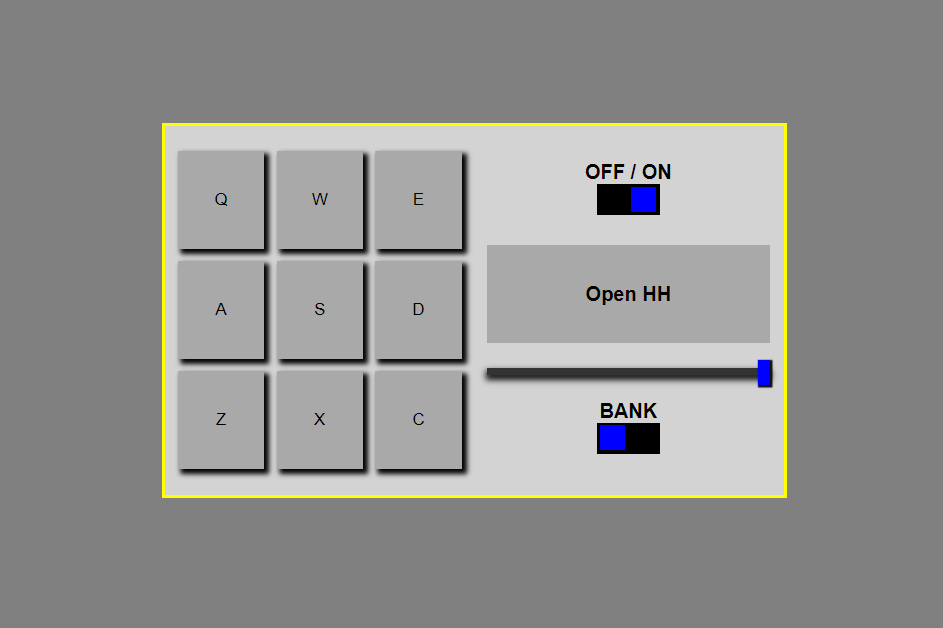

# My Drum Machine
## [LIVE SITE](https://drummachine-nd.netlify.app/)

## Introduction
This site was made as part of the freeCodeCamp curriculum. Since I have been building so much, I needed some inspiration on a small, hour-long project, so I went to freeCodeCamp. Here is the site!

## Features
The user can click on any of the buttons which will produce a sound dependent on which 'Bank' is selected. There are two different sets of sounds, one for softer sounds and another for harsher sounds. The drumpads volume can be controlled and it can be turned off or on.

## Technology Used
- ReactJS
- HTML
- CSS
